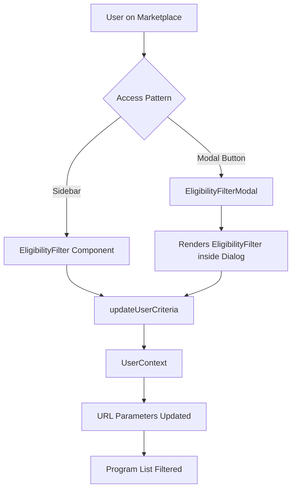
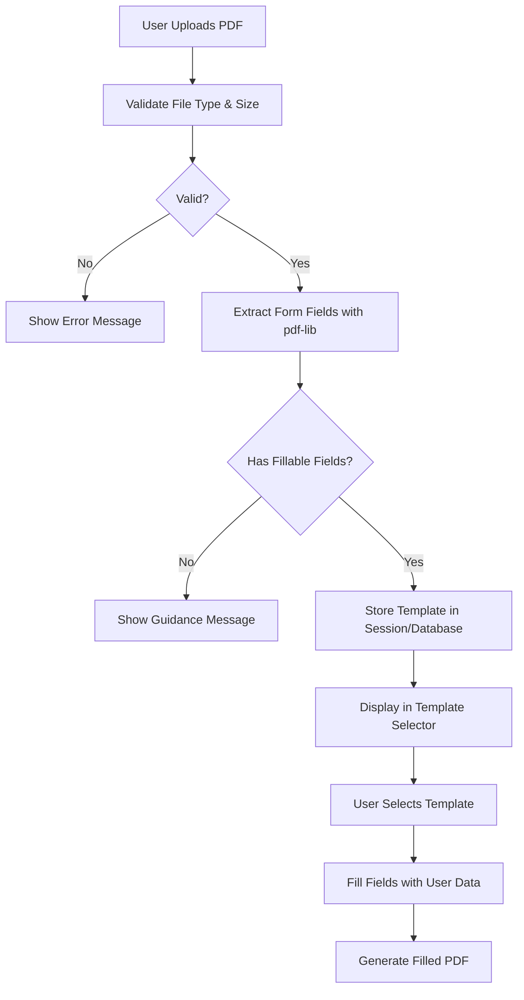

# Design Document: UX Improvements

## Overview

This feature enhances the BantuArah platform's usability through four targeted improvements:

1. **Improved Eligibility Search Access** - Provides multiple access patterns (sidebar + modal) for marketplace filtering to reduce cognitive load and improve discoverability
2. **Natural Indonesian Language and Tone** - Systematically transforms content to use natural, conversational Indonesian without English mixing or AI-generated patterns
3. **Optimized Chat Input Height** - Reduces chat input area from current implementation to improve message history visibility
4. **Custom PDF Template Upload** - Enables users to upload and use custom PDF templates for document generation when local government offices require specific formats

### Design Goals

- **Accessibility**: Maintain WCAG 2.1 AA compliance across all UI changes
- **Performance**: Filter state changes must complete within 500ms (Requirement 1.6)
- **Localization Quality**: Achieve natural Indonesian expression that feels peer-to-peer, not bureaucratic or robotic
- **Flexibility**: Support diverse user workflows with both preset templates and custom document uploads

## Architecture

### Component Structure

```
src/
├── components/
│   ├── marketplace/
│   │   ├── eligibility-filter.tsx          (Enhanced: add modal support)
│   │   ├── eligibility-filter-modal.tsx    (New: modal wrapper)
│   │   └── program-card.tsx                (Existing: no changes)
│   ├── unified-chat/
│   │   └── unified-chat-interface.tsx      (Modified: input height optimization)
│   └── documents/
│       ├── pdf-uploader.tsx                (New: custom PDF upload component)
│       ├── pdf-field-extractor.ts          (New: PDF form field extraction logic)
│       └── template-selector.tsx           (Modified: support custom templates)
├── lib/
│   ├── content-transformer.ts              (New: content localization utilities)
│   └── pdf-processing/
│       ├── field-extractor.ts              (New: pdf-lib wrapper for form extraction)
│       └── template-filler.ts              (New: fill PDF forms with user data)
└── data/
    └── content-mappings.ts                 (New: Indonesian content transformations)
```

### Data Flow

#### Eligibility Filter Access Patterns



#### PDF Template Upload Flow



## Components and Interfaces

### 1. Eligibility Filter Modal Component

**File**: `src/components/marketplace/eligibility-filter-modal.tsx`

```typescript
interface EligibilityFilterModalProps {
  open: boolean;
  onOpenChange: (open: boolean) => void;
  onFilterChange?: (criteria: UserCriteria) => void;
}

/**
 * Modal wrapper for EligibilityFilter component
 * Provides alternative access pattern to sidebar filtering
 * 
 * Accessibility:
 * - Focus trap when modal is open
 * - Escape key to close
 * - Focus returns to trigger button on close
 * - aria-modal="true" and role="dialog"
 */
export function EligibilityFilterModal({
  open,
  onOpenChange,
  onFilterChange
}: EligibilityFilterModalProps): JSX.Element
```

**Implementation Notes**:
- Uses shadcn/ui Dialog component (already accessible with proper ARIA attributes)
- Content is rendered inside Dialog with max-width constraint for readability
- Filter state is shared with sidebar through UserContext
- Modal includes header with title "Filter Kelayakan" and close button
- Mobile-first: full-screen on small devices, centered dialog on desktop

### 2. PDF Uploader Component

**File**: `src/components/documents/pdf-uploader.tsx`

```typescript
interface PdfUploaderProps {
  onUploadSuccess: (template: CustomPdfTemplate) => void;
  onUploadError: (error: string) => void;
  maxSizeMB?: number; // Default: 5MB
}

interface CustomPdfTemplate {
  id: string;
  name: string;
  uploadedAt: Date;
  fields: PdfFormField[];
  fileData: ArrayBuffer;
}

interface PdfFormField {
  name: string;
  type: 'text' | 'checkbox' | 'radio' | 'dropdown' | 'signature';
  value?: string;
  options?: string[]; // For dropdown/radio fields
  required?: boolean;
}

/**
 * PDF upload component with drag-and-drop and file picker
 * Validates file type and size, extracts form fields
 */
export function PdfUploader({
  onUploadSuccess,
  onUploadError,
  maxSizeMB = 5
}: PdfUploaderProps): JSX.Element
```

**Features**:
- Drag-and-drop zone with visual feedback
- File picker fallback for accessibility
- Progress indicator during upload and processing
- Clear error messages in Indonesian
- Preview of extracted fields before confirmation

### 3. PDF Field Extractor

**File**: `src/lib/pdf-processing/field-extractor.ts`

```typescript
/**
 * Extracts form fields from PDF using pdf-lib
 * Handles AcroForm fields (standard fillable PDFs)
 * XFA forms are not supported (limitation of pdf-lib)
 */
export async function extractPdfFormFields(
  pdfArrayBuffer: ArrayBuffer
): Promise<PdfFormField[]>

/**
 * Validates if PDF has fillable form fields
 */
export async function hasFormFields(
  pdfArrayBuffer: ArrayBuffer
): Promise<boolean>

/**
 * Fills PDF form fields with user data
 * Returns new PDF as ArrayBuffer
 */
export async function fillPdfTemplate(
  templateArrayBuffer: ArrayBuffer,
  fieldValues: Record<string, string>
): Promise<ArrayBuffer>
```

**Library Choice**: [pdf-lib](https://pdf-lib.js.org/)
- Open-source, widely used (10k+ GitHub stars)
- Works in browser and Node.js
- Supports AcroForm field extraction and modification
- No external dependencies
- MIT license

**Limitations**:
- XFA forms not supported (Adobe's proprietary format)
- Complex PDF structures may not extract correctly
- Users will receive guidance to use Adobe Acrobat or LibreOffice to create AcroForm PDFs

### 4. Content Transformation System

**File**: `src/lib/content-transformer.ts`

```typescript
interface ContentTransformation {
  original: string;
  transformed: string;
  category: 'ui-label' | 'message' | 'instruction' | 'ai-response';
  reason?: string; // Why transformation was applied
}

/**
 * Transforms English-mixed text to pure Indonesian
 */
export function removeEnglishMixing(text: string): string

/**
 * Converts formal bureaucratic language to conversational tone
 */
export function convertToConversational(text: string): string

/**
 * Removes AI-generated language patterns
 * - Overly enthusiastic tone ("Yuk!", excessive exclamation marks)
 * - Robotic transitions ("Selanjutnya,", "Kemudian,")
 * - Unnatural phrasing common in GPT outputs
 */
export function removeAiPatterns(text: string): string

/**
 * Main transformation pipeline
 * Applies all transformations in sequence
 */
export function transformContent(
  text: string,
  category: ContentTransformation['category']
): ContentTransformation
```

**Content Mappings**: `src/data/content-mappings.ts`

Research indicates Indonesian users prefer:
- Pure Bahasa Indonesia without English mixing ([source](https://medium.com/tokopedia-product-team/product-strategy-101-for-indonesia-538d25423482))
- Informal, peer-to-peer tone over bureaucratic language
- Direct address using "kamu" or "Anda" consistently
- Active voice over passive constructions

Example transformations:
```typescript
export const ENGLISH_TO_INDONESIAN = {
  // UI terms
  'button': 'tombol',
  'submit': 'kirim',
  'cancel': 'batal',
  'filter': 'saring',
  'search': 'cari',
  
  // Common app terms
  'marketplace': 'pasar program',
  'dashboard': 'beranda',
  'profile': 'profil',
  'settings': 'pengaturan',
  
  // Program terms (preserve official names)
  'PKH': 'PKH', // Official program name, do not translate
  'BPNT': 'BPNT', // Official program name, do not translate
}

export const FORMAL_TO_CONVERSATIONAL = {
  'Silakan mengisi formulir': 'Isi formulir ini',
  'Apakah Bapak/Ibu memiliki': 'Apakah kamu punya',
  'Mohon untuk': 'Tolong',
  'Dengan hormat': '', // Remove formal salutations
}

export const AI_PATTERNS_TO_REMOVE = [
  { pattern: /Yuk[,!]?\s/gi, replacement: '' },
  { pattern: /Ayo[,!]?\s/gi, replacement: '' },
  { pattern: /Selanjutnya,\s/gi, replacement: '' },
  { pattern: /Kemudian,\s/gi, replacement: '' },
  { pattern: /!{2,}/g, replacement: '!' }, // Multiple exclamation marks
]
```

### 5. Chat Input Optimization

**File**: `src/components/unified-chat/unified-chat-interface.tsx` (Modified)

**Current Implementation Analysis**:
- Input component uses default shadcn/ui Input height (h-10 = 40px)
- No explicit max-height constraint on multi-line expansion
- Message area has flex-1 class (takes remaining space)

**Changes Required**:

```typescript
// Input area container modifications
<div className="border-t bg-background p-4">
  <form onSubmit={handleSubmit} className="flex space-x-2">
    <Textarea
      value={input}
      onChange={(e) => setInput(e.target.value)}
      placeholder="Ceritakan situasi kamu..."
      disabled={status !== 'ready'}
      className="flex-1 resize-none min-h-[48px] max-h-[120px] overflow-y-auto"
      rows={1}
      onInput={handleAutoResize}
    />
    {/* ... send button ... */}
  </form>
</div>
```

**Key Changes**:
- Replace `Input` with `Textarea` for multi-line support
- `min-h-[48px]` (default state, ≤60px per requirement)
- `max-h-[120px]` (maximum expansion per Requirement 3.2)
- `overflow-y-auto` (internal scrolling when exceeding max-height per Requirement 3.3)
- Auto-resize function adjusts height based on content up to max
- Message history container keeps `flex-1` to consume remaining vertical space (satisfies 70% allocation in Requirement 3.4)

## Data Models

### Custom PDF Template Storage

```typescript
interface CustomPdfTemplate {
  id: string; // UUID
  userId: string; // Associated user (if authenticated)
  sessionId: string; // Or session ID for anonymous users
  name: string; // Filename or user-provided name
  uploadedAt: Date;
  fileData: ArrayBuffer; // Original PDF file
  fields: PdfFormField[]; // Extracted form fields
  metadata: {
    fileSize: number; // Bytes
    pageCount: number;
    hasFormFields: boolean;
  };
}

interface PdfFormField {
  name: string; // Field name from PDF
  type: 'text' | 'checkbox' | 'radio' | 'dropdown' | 'signature';
  value?: string; // Current value
  defaultValue?: string; // Default from PDF
  options?: string[]; // For dropdown/radio
  required?: boolean;
  readOnly?: boolean;
}
```

**Storage Strategy**:
- **Session-based** (Phase 1): Store in UserContext for current session only
- **Database** (Phase 2): Persist to database for authenticated users
- **File size limit**: 5MB per Requirement 4.3
- **Cleanup**: Remove templates older than 7 days if no user activity

### Content Transformation Audit

```typescript
interface ContentAuditEntry {
  id: string;
  componentPath: string; // File path where content found
  lineNumber: number;
  original: string;
  transformed: string;
  category: 'ui-label' | 'message' | 'instruction' | 'ai-response';
  appliedTransformations: string[]; // Names of transformation functions applied
  needsManualReview: boolean;
  reviewedAt?: Date;
  reviewedBy?: string;
}
```

**Audit Process**:
1. Scan all `.tsx` files for user-facing text strings
2. Classify each string by category
3. Apply transformation pipeline
4. Generate report comparing original vs transformed
5. Flag items needing manual review (ambiguous cases, technical terms)

## Error Handling

### PDF Upload Error Scenarios

| Error Condition | User Message (Indonesian) | HTTP Status | Recovery Action |
|----------------|---------------------------|-------------|-----------------|
| File too large (>5MB) | "File terlalu besar. Maksimal 5MB. File kamu: {size}MB" | 413 | User selects smaller file or compresses PDF |
| Invalid file type | "File harus berformat PDF. File kamu: {type}" | 400 | User selects PDF file |
| Corrupted PDF | "File PDF rusak atau tidak bisa dibaca" | 422 | User re-exports PDF or tries different file |
| No form fields | "PDF ini tidak punya kolom yang bisa diisi. Butuh bantuan membuat PDF dengan kolom isian?" + [link to guide] | 200 | User learns to create fillable PDFs or uses built-in templates |
| Extraction failure | "Gagal membaca kolom dari PDF. Coba file lain atau gunakan template bawaan" | 500 | User tries different PDF or uses built-in template |
| Network error during upload | "Koneksi terputus. Coba lagi?" | - | Retry upload with same file |

### Filter Performance Errors

| Error Condition | User Message (Indonesian) | Recovery Action |
|----------------|---------------------------|-----------------|
| Filter update timeout (>500ms) | "Penyaringan memakan waktu lama. Coba refresh halaman?" | User refreshes page or simplifies filter criteria |
| URL parameter parsing error | Silent recovery: Load with empty filters | System logs error, user sees empty state |
| Invalid filter values | "Beberapa filter tidak valid dan telah di-reset" | Clear invalid values, keep valid ones |

### Content Transformation Errors

| Error Condition | Handling Strategy |
|----------------|-------------------|
| Transformation produces empty string | Use original text, log warning |
| Semantic meaning loss detected | Flag for manual review, use original temporarily |
| Technical term incorrectly translated | Preserve term using TECHNICAL_TERMS whitelist |

## Testing Strategy

### Unit Testing

This feature involves UI rendering, layout changes, content transformation, and file processing. Property-based testing is **not applicable** for these types of changes. We will use:

1. **Example-based unit tests** for pure functions (content transformers, PDF validators)
2. **Component tests** using React Testing Library for UI components
3. **Integration tests** for PDF processing workflows
4. **Manual testing** for visual design, layout proportions, and language quality

**Test Coverage Areas**:

#### Content Transformation
- `removeEnglishMixing()`: Test known English-Indonesian pairs
- `convertToConversational()`: Test formal-to-informal transformations
- `removeAiPatterns()`: Test removal of "Yuk!", multiple "!", robotic transitions
- Edge cases: Empty strings, technical terms (should be preserved), proper nouns

#### PDF Processing
- **File validation**:
  - Valid PDF files (various sizes)
  - Files exceeding 5MB limit
  - Non-PDF files (images, Word docs, etc.)
  - Corrupted/malformed PDFs
- **Field extraction**:
  - PDFs with AcroForm fields (text, checkbox, radio, dropdown)
  - PDFs without form fields
  - PDFs with complex field structures
- **Field filling**:
  - Fill all field types with test data
  - Handle missing field mappings
  - Preserve PDF formatting and layout

#### Eligibility Filter Modal
- Modal opens/closes correctly
- Filter state syncs with sidebar version
- Focus management (trap, restore on close)
- Keyboard navigation (Escape to close, Tab through inputs)
- Mobile responsiveness (full-screen vs centered)

#### Chat Input Height
- Default height ≤60px (measure rendered height)
- Multi-line expansion up to 120px max
- Internal scrolling when exceeding max height
- Message history occupies ≥70% of vertical space
- Send button remains vertically centered
- Consistent behavior across screen sizes

### Integration Testing

1. **Filter Access Pattern Switching**
   - User sets filters in sidebar
   - Opens modal
   - Verifies filter state persisted in modal
   - Changes filters in modal
   - Closes modal
   - Verifies sidebar reflects changes

2. **PDF Template End-to-End Flow**
   - Upload valid PDF with form fields
   - Verify fields extracted correctly
   - Select custom template in document generator
   - Fill template with user data
   - Download generated PDF
   - Verify filled values present in PDF

3. **Content Transformation Application**
   - Run content audit across codebase
   - Apply transformations to identified strings
   - Verify UI still renders correctly
   - Check no broken translations or empty labels

### Manual Testing Requirements

**Visual Design**:
- Chat input proportions feel balanced on mobile, tablet, desktop
- Modal filter interface matches sidebar styling
- PDF uploader drag-drop zone has clear visual affordances
- Error messages display clearly with appropriate icons

**Language Quality** (requires Indonesian native speaker):
- Transformed content sounds natural and conversational
- No awkward phrasings or direct translations
- Tone is consistent across the application
- Technical terms and program names preserved correctly
- No mixing of English words in Indonesian sentences

**Accessibility**:
- Screen reader announces modal role and label
- Focus trap works in modal
- Keyboard navigation smooth in filter modal
- PDF uploader accessible via keyboard
- Color contrast meets WCAG AA standards
- Error messages announced to screen readers

### Test Data Requirements

**Sample PDFs for Testing**:
- `sample-acroform-simple.pdf` - Basic form with text, checkbox, dropdown fields
- `sample-acroform-complex.pdf` - Multi-page form with conditional fields
- `sample-no-fields.pdf` - PDF without any form fields
- `sample-xfa-form.pdf` - XFA form (should show "not supported" message)
- `sample-large-6mb.pdf` - Exceeds size limit (should reject)
- `sample-corrupted.pdf` - Malformed PDF file

**Content Transformation Test Cases**:
- Text with English mixing ("Silakan submit form ini")
- Formal bureaucratic language ("Dengan hormat, Bapak/Ibu dimohon untuk...")
- AI-generated patterns ("Yuk! Mari kita mulai dengan...")
- Technical terms that should be preserved ("API endpoint", "database")
- Official program names ("PKH", "BPNT", "KIP Kuliah")

## Performance Considerations

### Filter Update Performance

**Requirement**: Filter state changes complete within 500ms (Requirement 1.6)

**Optimization Strategies**:
- Debounce text input changes (300ms delay)
- Memoize `calculateEligibility` results with `useMemo`
- Memoize filtered program list
- Lazy load modal content (don't render until first open)
- Use `useTransition` for non-urgent state updates

**Performance Budget**:
- Filter state update: <100ms
- URL parameter serialization: <50ms
- Program list re-filtering: <200ms
- UI re-render: <150ms
- Total: <500ms

### PDF Processing Performance

**File size impacts**:
- 1MB PDF: ~500ms extraction time
- 5MB PDF: ~2-3s extraction time

**Optimization Strategies**:
- Show loading indicator during extraction
- Process in Web Worker to avoid blocking main thread
- Cache extraction results per file hash
- Limit concurrent uploads to 1 at a time

### Content Transformation Performance

**Build-time vs Runtime**:
- Content transformation should happen at **build time** when possible
- Use script to pre-process static content strings
- Runtime transformation only for dynamic AI responses

## Accessibility Compliance

### Modal Dialog Accessibility

Following WAI-ARIA best practices for [dialog (modal)](https://www.w3.org/WAI/ARIA/apg/patterns/dialog-modal/):

**Required ARIA Attributes**:
- `role="dialog"` on modal container
- `aria-modal="true"` to indicate modal behavior
- `aria-labelledby` pointing to modal title ID
- `aria-describedby` pointing to description (if present)

**Focus Management**:
- Focus moves to first focusable element when modal opens
- Focus is trapped within modal (Tab cycles through modal elements)
- Escape key closes modal
- Focus returns to trigger button when modal closes

**Implementation** (using shadcn/ui Dialog):
```typescript
<Dialog open={open} onOpenChange={onOpenChange}>
  <DialogTrigger asChild>
    <Button variant="outline" aria-label="Buka filter kelayakan">
      <Filter className="h-4 w-4 mr-2" />
      Filter
    </Button>
  </DialogTrigger>
  <DialogContent aria-describedby="filter-description">
    <DialogTitle id="filter-title">Filter Kelayakan</DialogTitle>
    <p id="filter-description" className="sr-only">
      Gunakan filter ini untuk menemukan program yang sesuai dengan situasi kamu
    </p>
    <EligibilityFilter onFilterChange={handleFilterChange} />
  </DialogContent>
</Dialog>
```

### PDF Uploader Accessibility

- Drag-drop zone has keyboard-accessible fallback (file input)
- `aria-label` describes purpose of file input
- Error messages have `role="alert"` for screen reader announcement
- Loading states communicated via `aria-live="polite"` region
- Success confirmation announced to screen readers

### Chat Input Accessibility

- Textarea has descriptive `aria-label` or associated `<label>`
- Send button has clear label ("Kirim pesan")
- Character/line indicators (if added) announced to screen readers
- Auto-resize doesn't disrupt screen reader position

## Deployment Considerations

### Feature Flags

Consider feature flags for gradual rollout:
- `ENABLE_FILTER_MODAL` - Enable modal access pattern
- `ENABLE_PDF_UPLOAD` - Enable custom PDF template upload
- `ENABLE_CONTENT_TRANSFORMATION` - Apply new Indonesian content

**Rollout Strategy**:
1. Deploy with all flags OFF, code present but inactive
2. Enable `ENABLE_FILTER_MODAL` for 10% of users, monitor
3. Enable `ENABLE_CONTENT_TRANSFORMATION` for 50% of users, gather feedback
4. Enable `ENABLE_PDF_UPLOAD` for 100% of users
5. Remove flags after stable period

### Database Migrations

If implementing persistent storage for custom PDF templates:

```sql
CREATE TABLE custom_pdf_templates (
  id UUID PRIMARY KEY DEFAULT gen_random_uuid(),
  user_id VARCHAR(255), -- NULL for anonymous sessions
  session_id VARCHAR(255), -- For anonymous users
  name VARCHAR(255) NOT NULL,
  file_data BYTEA NOT NULL, -- PDF file bytes
  fields JSONB NOT NULL, -- Extracted fields as JSON
  metadata JSONB NOT NULL, -- File size, page count, etc.
  uploaded_at TIMESTAMP DEFAULT NOW(),
  last_used_at TIMESTAMP DEFAULT NOW(),
  created_at TIMESTAMP DEFAULT NOW(),
  
  -- Cleanup policy: delete after 7 days of inactivity
  CONSTRAINT check_file_size CHECK (LENGTH(file_data) <= 5242880) -- 5MB in bytes
);

-- Index for efficient user/session lookups
CREATE INDEX idx_templates_user ON custom_pdf_templates(user_id) WHERE user_id IS NOT NULL;
CREATE INDEX idx_templates_session ON custom_pdf_templates(session_id) WHERE session_id IS NOT NULL;

-- Index for cleanup job
CREATE INDEX idx_templates_cleanup ON custom_pdf_templates(last_used_at) WHERE last_used_at < NOW() - INTERVAL '7 days';
```

### Monitoring and Analytics

**Metrics to Track**:
- Filter modal open rate vs sidebar usage (understand user preference)
- Custom PDF upload success/failure rates
- PDF upload file sizes (adjust limit if needed)
- Content transformation error rates
- Filter update performance (P95, P99 latency)
- Modal accessibility interactions (keyboard vs mouse)

**Error Tracking**:
- PDF processing failures (with sanitized error details)
- Content transformation semantic loss events
- Filter timeout occurrences
- Modal focus trap issues

## Open Questions and Future Enhancements

### Phase 2 Enhancements

1. **Filter Presets from AI Chat**
   - AI chat can detect user situation and pre-fill filters
   - "Klik di sini untuk lihat program cocok untuk kamu" button in chat
   - Opens marketplace with filters pre-populated from conversation

2. **PDF Template Marketplace**
   - Community-contributed PDF templates
   - Templates specific to regional government offices
   - Verified/official templates from government partners

3. **Advanced Content Localization**
   - Support for regional dialects (Javanese-influenced Indonesian, etc.)
   - Formality level adjustment based on user preference
   - AI-assisted content review tool for quality assurance

4. **Offline PDF Processing**
   - Service worker to cache PDF templates
   - Client-side PDF generation without server round-trip
   - Progressive Web App capability

### Known Limitations

1. **XFA Forms Not Supported**
   - pdf-lib only supports AcroForm, not XFA (Adobe's XML Forms Architecture)
   - Users with XFA forms will receive guidance to convert to AcroForm
   - Workaround: Provide conversion guide or recommend tools

2. **Complex PDF Structures**
   - Some PDFs with custom scripts or advanced features may not extract correctly
   - Fallback: User can manually enter field names and mappings

3. **Content Transformation Accuracy**
   - Automated transformation may miss context-specific nuances
   - Manual review required for AI-generated responses
   - Continuous improvement based on user feedback

## Summary

This design provides a comprehensive approach to improving BantuArah's UX through four interconnected enhancements. The dual-access pattern for filters, natural Indonesian content, optimized chat layout, and custom PDF upload capability address real user needs identified in requirements.

**Key Technical Decisions**:
- Use shadcn/ui Dialog for accessible modal implementation
- Use pdf-lib for client-side PDF processing (open-source, widely supported)
- Implement content transformation as build-time + runtime hybrid
- Session-based storage initially, with path to persistent database storage
- Performance budget: <500ms for filter updates, <3s for PDF processing

**Next Steps**:
1. Review design with Indonesian-speaking UX reviewer for language quality
2. Create PDF processing service module with pdf-lib
3. Build content transformation script and audit codebase
4. Implement modal access pattern for filters
5. Optimize chat input component layout
